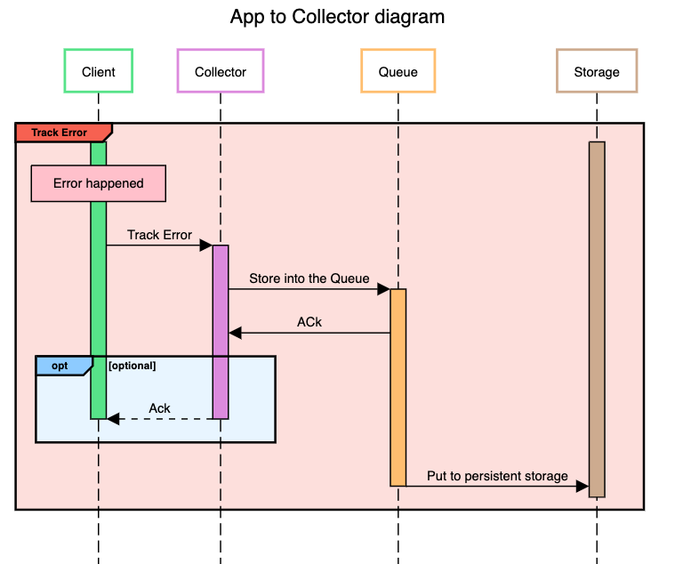

# Facta.Collector

API service for collecting events from client applications.

## Work concept

Collector work as ingate to the event strorage.
It expose API via [gRPC](https://grpc.io/).

Base address: `collector.facta.app`.

### Events

There are few types of events:
- `init`
- `track`
- `track_error`

### `init` event


`init` event is sent to the collector when client application start.


```proto
message InitRequest {
    string message_id = 1;
    string app_id = 2;
    string app_version = 3;
    string module_name = 4;
    string module_version = 5;
    string ram = 6;
    string cpu = 7;
    string arch = 8;
    string os_name = 9;
    string os_version = 10;
    string locale = 11;
    google.protobuf.Timestamp date_time = 12;
}
```

### `track` event


`track` used to send event data or error to the collector.


```proto
message TrackRequest {
    string message_id = 1;
    string session_id = 2;
    string name = 3;
    google.protobuf.Timestamp date_time = 4;
    google.protobuf.Value payload = 5;
}
```

### `track_error` event



`track_error` used to send event data or error to the collector.

```proto
message TrackErrorRequest {
    string message_id = 1;
    string session_id = 2;
    string name = 3;
    google.protobuf.Timestamp date_time = 4;
    google.protobuf.Value payload = 5;
}
```

### Reply

```proto
message TrackReply {
    bool ack = 1;
    string session_id = 2;
    string message_id = 3;
}
```